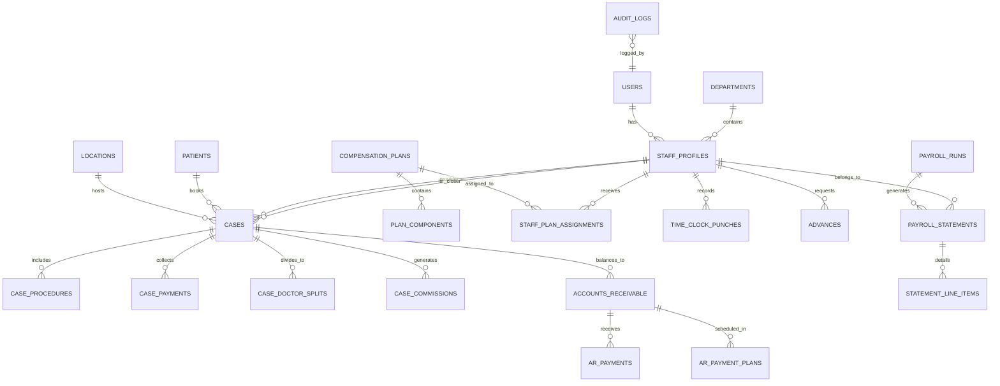

# NexaTrack — Complete Page-by-Page Analysis & Backend Database Schema Specification

> **Project Name:** NexaTrack — Dental Practice & Commission Management System  
> **Target Audience:** Backend Engineers, Database Architects & Full-Stack Developers  
> **Purpose:** Page-by-Page analysis of UI mockups to design Database Tables, Relationships, Calculations, and REST API Endpoints.  
> **Document Version:** 1.0.0 (Comprehensive Specification)

---

## Table of Contents
1. [System Architecture & Core Domain Model](#1-system-architecture--core-domain-model)
2. [Global Entity-Relationship Overview](#2-global-entity-relationship-overview)
3. [Page-by-Page Detailed Analysis (Admin & Core Management)](#3-page-by-page-detailed-analysis-admin--core-management)
   - [3.1 index.html — Authentication & Role Routing](#31-indexhtml--authentication--role-routing)
   - [3.2 dashboard.html — Practice Performance & Payroll Command Center](#32-dashboardhtml--practice-performance--payroll-command-center)
   - [3.3 cases.html — Clinical Cases Pipeline (Table & Board Views)](#33-caseshtml--clinical-cases-pipeline-table--board-views)
   - [3.4 new-case.html — 4-Step Treatment & Financial Intake Wizard](#34-new-casehtml--4-step-treatment--financial-intake-wizard)
   - [3.5 production.html — Clinical & Departmental Production Tracking](#35-productionhtml--clinical--departmental-production-tracking)
   - [3.6 accounts-receivable.html — Accounts Receivable Ledger & Aging Buckets](#36-accounts-receivablehtml--accounts-receivable-ledger--aging-buckets)
   - [3.7 compensation-rules.html — Dynamic Modular Commission Rules Engine](#37-compensation-ruleshtml--dynamic-modular-commission-rules-engine)
   - [3.8 team-members.html — Staff Management & Inline Compensation Plan Assignment](#38-team-membershtml--staff-management--inline-compensation-plan-assignment)
   - [3.9 advances.html — Employee Advances & Payroll Recovery Ledger](#39-advanceshtml--employee-advances--payroll-recovery-ledger)
   - [3.10 statements.html — Master Periodic Compensation Statements](#310-statementshtml--master-periodic-compensation-statements)
   - [3.11 payroll-runs.html — 4-Stage Payroll Batch Execution & Review Center](#311-payroll-runshtml--4-stage-payroll-batch-execution--review-center)
   - [3.12 reports.html — Financial, AR, Production & Performance Analytics](#312-reportshtml--financial-ar-production--performance-analytics)
   - [3.13 settings.html — Practice Config & 7-Column Payroll Correction Audit Trail](#313-settingshtml--practice-config--7-column-payroll-correction-audit-trail)
4. [Page-by-Page Detailed Analysis (Department & Role Portals)](#4-page-by-page-detailed-analysis-department--role-portals)
   - [4.1 SDR Portal (Sales Development Reps)](#41-sdr-portal-sales-development-reps)
   - [4.2 ISR Portal (Inside Sales Reps / Closers)](#42-isr-portal-inside-sales-reps--closers)
   - [4.3 Doctors / Clinical Providers Portal](#43-doctors--clinical-providers-portal)
   - [4.4 Dental Assistants & Clinical Educators (CE) Portals](#44-dental-assistants--clinical-educators-ce-portals)
   - [4.5 Marketing, Social Media & Quality Specialist (QS) Portals](#45-marketing-social-media--quality-specialist-qs-portals)
5. ["Everything Dynamic" Architecture & Configurable Generic Engine Philosophy](#5-everything-dynamic-architecture--configurable-generic-engine-philosophy)
6. [Complete Relational Database Schema (Fully Dynamic SQL Blueprint)](#6-complete-relational-database-schema-fully-dynamic-sql-blueprint)
7. [Dynamic Business Calculations & Rule Execution Engine](#7-dynamic-business-calculations--rule-execution-engine)
8. [RESTful API Endpoints Catalog (Core & Dynamic Configuration)](#8-restful-api-endpoints-catalog-core--dynamic-configuration)

---

## 1. System Architecture & Core Domain Model

NexaTrack ek specialized **Dental Practice Management, Clinical Production Tracking, and Tiered Commission/Payroll Engine** hai. Iska backend 6 bare core domains par mushtamil hai:

1. **User, Staff & RBAC Domain:** Authentication, departmental segregation (Doctors, ISR, SDR, CE, DA, Marketing, Admin), aur granular permissions.
2. **Clinical Case & Treatment Domain:** Patient records, cosmetic veneers (composite, ceramic, porcelain, crowns), general dentistry procedures (CDT codes), doctor splits (prep vs cement doctor).
3. **Financials & Accounts Receivable (AR) Domain:** Treatment quotes, payments collection (Cash, Card, Financing), remaining balances, automatic AR invoice creation, aging brackets (0–30, 31–60, 61–90, 90+ days), and payment plans.
4. **Compensation & Rules Engine Domain:** Decoupled modular plans, tier commission ($700 / $800 / $1000 per full case, 50% half cases), hourly wages, appointment show bonuses, pod overrides (1%–2%), and lab cost deductions.
5. **Payroll Batch Processing & Ledger Domain:** Draft -> Review Center -> Final Summary -> Locked immutable payroll runs, employee pay-stubs, ACH/direct deposit exports, advances/draw recoveries.
6. **Audit & Compliance Domain:** Har adjustment aur correction ka 7-column immutable audit log (Manager vs Other Role, original value, corrected value, resulting financial delta, and reason).

---

## 2. Global Entity-Relationship Overview



---

## 3. Page-by-Page Detailed Analysis (Admin & Core Management)

---

### 3.1 index.html — Authentication & Role Routing

#### Purpose & Business Role
Yeh application ka initial login gateway hai. Yahan par practice staff apna username/email aur password enter karta hai. User ka role evaluate kar ke system usay specific dashboard par route karta hai:
- `Office Manager / Super Admin` $\rightarrow$ `dashboard.html`
- `SDR (Sales Development Rep)` $\rightarrow$ `SDR/Empdahshabord.html`
- `ISR (Inside Sales Rep)` $\rightarrow$ `ISR/Empdahshabord.html`
- `Doctor / Provider` $\rightarrow$ `Doctores/Empdahshabord.html`
- `Dental Assistant` $\rightarrow$ `Dental Assistants/Empdahshabord.html`
- `CE (Clinical Educator)` $\rightarrow$ `CE/Empdahshabord.html`
- `Marketing / Social Media / QS` $\rightarrow$ respective folder dashboards

#### UI Inputs & Elements
- **Username / Email Input:** String (`username` or `email`).
- **Password Input:** String (`password`).
- **Remember Me Checkbox:** Boolean.
- **Login Button & Forgot Password Link.**
- **Role selector / Quick Switcher** (in mockups for fast preview).

#### Backend Entities & Schema Needed
- **`users`**: `id`, `uuid`, `username`, `email`, `password_hash`, `status` (`active`, `suspended`), `last_login_at`, `created_at`, `updated_at`.
- **`roles`**: `id`, `name` (`office_manager`, `provider`, `isr`, `sdr`, `ce`, `da`, `marketing`), `guard_name`.
- **`user_roles`**: `user_id`, `role_id`.
- **`user_sessions` / `personal_access_tokens`**: Token authentication, session tracking, device info, IP address.

#### API Endpoints
- `POST /api/v1/auth/login` — Authenticate user and issue JWT/Sanctum token with user role & default redirect path.
- `POST /api/v1/auth/logout` — Invalidate user token.
- `GET /api/v1/auth/me` — Return current logged-in user details, active role, permissions, and staff profile ID.

---

### 3.2 dashboard.html — Practice Performance & Payroll Command Center

#### Purpose & Business Role
Office Manager aur Executive Leadership ke liye primary command center. Yahan clinical production, gross revenue, payroll liability, accounts receivable outstanding balance, aur case pipeline ka real-time snapshot show hota hai.

#### UI Inputs & Display Components
- **Pay Period / Date Range Picker:** Custom date range selection.
- **Top Metric / KPI Cards:**
  1. *Total Production Value* ($): Month-to-date practice production.
  2. *Total Commissions & Compensation* ($): Current cycle payroll liability.
  3. *Total Outstanding AR* ($): Uncollected patient balances.
  4. *Cases Completed vs In-Progress*: Active clinical pipeline numbers.
- **Pipeline Snapshot:** Case stages summary (Draft $\rightarrow$ Prep $\rightarrow$ Cement $\rightarrow$ Completed $\rightarrow$ Verified).
- **Recent Activity & Alerts Table:** Pending advance requests, payroll run deadlines, unverified high-value cases.
- **Quick Action Buttons:** "New Case", "Run Payroll", "Export Reports".

#### Backend Data Required
- Aggregated financial metrics computed over `cases`, `case_payments`, `accounts_receivable`, aur `payroll_runs` for the selected date range.

#### API Endpoints
- `GET /api/v1/dashboard/metrics?start_date={date}&end_date={date}` — Returns KPI counts and dollar sums.
- `GET /api/v1/dashboard/pipeline-summary` — Case counts grouped by stage.
- `GET /api/v1/dashboard/recent-activities` — Latest audit events, pending approvals, and notifications.

---

### 3.3 cases.html — Clinical Cases Pipeline (Table & Board Views)

#### Purpose & Business Role
Practice ke tamaam cosmetic aur general dentistry cases ko track karne ka hub. Yeh do views provide karta hai:
1. **Table View:** Structured rows with sorting, pagination, and multi-filter.
2. **Board (Kanban) View:** Stage-by-stage drag-and-drop workflow (Draft, Prep Complete, Waiting for Cement, Completed, Verified, Cancelled).

#### UI Inputs & Filters
- **View Toggle:** Table vs Board.
- **Date Range Picker:** Procedural or creation date filter.
- **Filters:** Department dropdown, Team Member / Provider dropdown, Case Type dropdown (Composite, Ceramic, Porcelain/Zirconia, Crowns), Status dropdown.
- **KPI Summary Cards:** Total Cases, Total Case Value, Average Case Value, Cases Started, Cases Completed.
- **Table Columns:** `Case ID`, `Patient Name`, `Case Type`, `Department`, `Provider/Closer`, `Status Badge`, `Treatment Value`, `Date Created`, `Action Buttons`.
- **Side Panel (Drawer):** Case detail inspector with patient demographics, assigned doctors, cosmetic units, procedure items, deposit collected, ISR commission, and audit history.

#### Backend Entities Needed
- **`cases`**:
  - `id` (BIGINT PK)
  - `case_number` (VARCHAR, e.g. `CASE-2026-000234`, UNIQUE)
  - `patient_id` (FK $\rightarrow$ `patients.id`)
  - `location_id` (FK $\rightarrow$ `locations.id`)
  - `procedure_date` (DATE)
  - `stage_id` / `status` (ENUM: `draft`, `prep_complete`, `waiting_cement`, `completed`, `verified`, `cancelled`)
  - `treatment_value` (DECIMAL 10,2)
  - `quoted_amount` (DECIMAL 10,2)
  - `collected_amount` (DECIMAL 10,2)
  - `ar_balance` (DECIMAL 10,2)
  - `lab_cost` (DECIMAL 10,2)
  - `notes` (TEXT)
  - `created_by` (FK $\rightarrow$ `users.id`)
  - `timestamps`

#### API Endpoints
- `GET /api/v1/cases` — List cases with query params (`view`, `status`, `provider_id`, `department_id`, `date_from`, `date_to`, `page`, `per_page`).
- `GET /api/v1/cases/{id}` — Full case detail with procedures, splits, payments, and notes.
- `PATCH /api/v1/cases/{id}/status` — Update case stage / status (triggers pipeline recalculation).
- `DELETE /api/v1/cases/{id}` — Soft delete case.

---

### 3.4 new-case.html — 4-Step Treatment & Financial Intake Wizard

#### Purpose & Business Role
Yeh NexaTrack ka **sab se critical operational intake form** hai. Jab clinic mein koi patient treatment start karta hai ya close hota hai, toh Office Manager ya Coordinator yeh 4-step wizard fill karta hai. NexaTrack automates:
- Doctor Prep (60%) vs Cement (40%) splits
- Material flat rate (16–20 units) vs mixed units calculation
- Accounts Receivable (AR) automatic difference detection
- Live payroll impact preview for providers and closers

#### Step-by-Step Breakdown

##### Step 1: Patient & Team
- **Inputs:**
  - `patient_search` / `patient_id` (Search existing or create new patient: First Name, Last Name, Phone, Email, DOB).
  - `case_number` (Auto-generated system sequence, e.g. `CASE-2026-000235`).
  - `procedure_date` (Date).
  - `location_id` (Fort Lauderdale, Boca Raton, Miami).
  - `provider_doctor_id` (Primary Doctor, e.g. Dr. Heider).
  - `doctor_role` (Dropdown: `Full Doctor (100%)`, `Prep Doctor (60%)`, `Cement Doctor (40%)`).
  - `isr_id` (Inside Sales Rep closer, e.g. Jeremiah Smith, M. Zubair).
  - `case_status` (Draft, Prep Complete, Waiting for Cement, Completed, Verified).

##### Step 2: Treatment & Cosmetic Units
- **Cosmetic Material Selector:**
  - Material Options: `Composite`, `Ceramic`, `Porcelain / Zirconia`, `Full Crown Case`.
  - Rate hint display per material.
- **Total Units Stepper:** Number of teeth/units (e.g. 16 units).
  - *Rule:* Agar all units same material hain aur count 16–20 hai toh **Flat Rate** apply hoga.
- **Mixed Materials Toggle (Yes/No):**
  - Agar "YES", toh individual inputs open honge:
    - `composite_units` (INT)
    - `ceramic_units` (INT)
    - `porcelain_units` (INT)
    - `crown_units` (INT)
  - *Rule:* Mixed case mein har unit uske specific per-unit rate par calculate hoga.
- **Doctor Split Configuration:**
  - `prep_doctor_id` (Receives 60% of doctor case pay).
  - `same_doctor_checkbox` (If checked, same doctor gets 100%).
  - `cement_doctor_id` (Receives 40% of doctor case pay if different).
- **General Dentistry Procedure Repeater:**
  - Add Procedure button $\rightarrow$ Multiple rows:
    - `cdt_code_id` / Procedure Name (e.g. D2391 Composite, D4341 Deep Cleaning, D2740 Ceramic Crown).
    - `tooth_number` / `quadrant`.
    - `fee` (DECIMAL).
    - `performing_doctor_id`.
    - `doctor_split_percentage` (e.g. 30% of procedure fee).

##### Step 3: Financial & AR Capture
- **Inputs:**
  - `treatment_value` ($): Total clinical value.
  - `quoted_amount` ($): Patient ko quote kiya gaya total price.
  - **Payment Types List (Repeater):**
    - `payment_method` (Cash, Credit Card, CareCredit, Cherry, Sunbit, Wire Transfer, Insurance).
    - `amount` ($).
    - `transaction_reference` (Transaction # or receipt ID).
  - **Automatic AR Difference Box:**
    - Formula: $\text{AR Difference} = \text{Quoted Amount} - \sum(\text{Collected Payments})$.
    - Agar $\text{AR Difference} > 0$, toh notice display hota hai: *"Remaining balance automatically initiates an audited record in the Accounts Receivable Ledger"*.
  - `lab_cost` ($): Dental lab fee deduction.
  - **Financing / Merchant Fees Repeater:**
    - `fee_type` (e.g. Cherry 7.9% merchant discount, CareCredit 5% fee).
    - `fee_amount` ($).
  - `case_notes` (Text).

##### Step 4: Review & Payroll Impact
- **Live Preview Summary:**
  - Provider Pay Breakdown (Cosmetic pay + General Dentistry pay).
  - ISR Commission Breakdown (Tier payout: $700/$800/$1000 or 50% half case).
  - Practice Net Production calculation.
- **Action:** "Save & Submit Case" button.

#### Backend Entities Needed
- **`patients`**: `id`, `first_name`, `last_name`, `email`, `phone`, `dob`, `address`, `created_at`.
- **`case_materials`**: Lookup table (`composite`, `ceramic`, `porcelain`, `crown`, base unit rates).
- **`case_units`**: `id`, `case_id`, `material_type`, `unit_count`, `rate_applied`, `line_total`.
- **`case_procedures`**: `id`, `case_id`, `cdt_code`, `procedure_name`, `tooth_number`, `fee`, `performing_doctor_id`, `doctor_pay`.
- **`case_payments`**: `id`, `case_id`, `payment_method`, `amount`, `payment_date`, `reference_no`.
- **`case_financing_fees`**: `id`, `case_id`, `fee_name`, `percentage`, `amount`.
- **`case_doctor_splits`**: `id`, `case_id`, `doctor_id`, `role` (`full`, `prep`, `cement`), `percentage` (100, 60, 40), `payout_amount`.
- **`case_commissions`**: `id`, `case_id`, `staff_id`, `role` (`isr`, `sdr`, `closer`), `tier_level`, `commission_amount`.

#### API Endpoints
- `POST /api/v1/cases/intake-calculate` — Stateless calculator endpoint jo Step 1, 2, 3 ka payload le kar live payroll split aur AR difference return karta hai bina DB mein save kiye.
- `POST /api/v1/cases` — Full case submission: creates patient (if new), case, procedures, payments, doctor splits, commissions, and AR entry in a single DB transaction.

---

### 3.5 production.html — Clinical & Departmental Production Tracking

#### Purpose & Business Role
Clinic ki clinical aur financial production ko measure karne ka page. Dental practice management mein **Gross Production** (total billed services) vs **Net Production** (Gross Production minus insurance write-offs, lab costs, and financing discounts) ko monitor karna zaroori hota hai kyunke doctors aur associate providers ko net production par commission milta hai.

#### UI Inputs & Table Columns
- **Date / Pay Period Filter:** Day, Week, Month, or Custom range.
- **Doctor / Location Filter:** Dropdown to filter by specific surgeon/dentist or practice branch.
- **KPI Summary Cards:**
  1. *Gross Production* ($)
  2. *Lab Fee Deductions* ($)
  3. *Adjustments / Discounts* ($)
  4. *Net Production Available for Payroll* ($)
- **Production Ledger Table:**
  - `Date`, `Case ID`, `Patient Name`, `Doctor Name`, `Category` (Cosmetic vs General), `Gross Value`, `Lab Cost`, `Merchant Fee`, `Net Production`, `Provider Earned Share`.
- **Export Options:** Export to CSV / PDF.

#### Backend Entities Needed
- **`production_entries`**:
  - `id` (PK)
  - `case_id` (FK)
  - `doctor_id` (FK $\rightarrow$ `staff_profiles.id`)
  - `entry_date` (DATE)
  - `category` (`cosmetic`, `general_dentistry`, `hygiene`)
  - `gross_amount` (DECIMAL)
  - `lab_deduction` (DECIMAL)
  - `adjustment_amount` (DECIMAL)
  - `net_amount` (DECIMAL)
  - `commission_rate` (DECIMAL, e.g. 35.00%)
  - `provider_payout` (DECIMAL)
  - `payroll_statement_id` (FK, nullable until assigned to a payroll run)

#### API Endpoints
- `GET /api/v1/production` — Production ledger rows with date/doctor filters.
- `GET /api/v1/production/summary` — Aggregate sums for KPI cards and charts.
- `POST /api/v1/production/adjustments` — Manually add a production adjustment/write-off.

---

### 3.6 accounts-receivable.html — Accounts Receivable Ledger & Aging Buckets

#### Purpose & Business Role
Agar koi patient pure paise upfront na de aur installment plan par ho, toh remaining balance AR ban jata hai. NexaTrack ka AR module practice ke cash flow ko secure karta hai through **Aging Buckets** aur patient payment schedules.

#### UI Inputs & Components
- **Top KPI Cards:**
  1. *Total Outstanding AR* ($42,650.00, 11 open patient cases)
  2. *Total Quoted Receivables* ($128,400.00)
  3. *Collected to Date* ($85,750.00, 66.8% Collection Rate)
  4. *Active Payment Plans* ($16,800.00, 3 patients on installments)
- **Interactive Aging Buckets Filter Bar:**
  - `All Receivables`
  - `Current / Due Soon (0–30 days)`
  - `Due (31–60 days)`
  - `Past Due (61–90 days)`
  - `High Risk / Collections (90+ days)`
- **Search & Filters:** Patient search input, payment plan status filter (`On Plan`, `No Plan`, `Defaulted`), aging bracket filter.
- **AR Ledger Table Columns:**
  - `AR Number` (e.g. `AR-2026-0042`)
  - `Patient Name & Contact`
  - `Case ID Reference`
  - `Quoted Amount` ($)
  - `Total Collected` ($)
  - `Remaining Balance Due` ($)
  - `Aging Category Badge` (0–30, 31–60, 61–90, 90+)
  - `Days Outstanding` (INT)
  - `Payment Plan Status`
  - `Last Activity / Note`
  - `Action Menu` (Collect Payment, Setup Payment Plan, Add Note, Write Off)
- **Modals:**
  - `#newArModal`: Manual receivable creation.
  - `#recordPaymentModal`: Record partial installment payment.
  - `#paymentPlanModal`: Set up recurring installment amount, frequency, and payment dates.

#### Backend Entities Needed
- **`accounts_receivable`**:
  - `id` (PK)
  - `ar_number` (VARCHAR, UNIQUE)
  - `case_id` (FK $\rightarrow$ `cases.id`, nullable if standalone dental balance)
  - `patient_id` (FK $\rightarrow$ `patients.id`)
  - `total_quoted` (DECIMAL 10,2)
  - `total_collected` (DECIMAL 10,2)
  - `balance_due` (DECIMAL 10,2, GENERATED or maintained via trigger)
  - `original_date` (DATE)
  - `days_aged` (VIRTUAL / COMPUTED: `DATEDIFF(CURRENT_DATE, original_date)`)
  - `aging_bracket` (ENUM: `0-30`, `31-60`, `61-90`, `90+`)
  - `status` (ENUM: `open`, `payment_plan`, `paid_in_full`, `written_off`, `sent_to_collections`)
- **`ar_payments`**:
  - `id` (PK), `ar_id` (FK), `amount`, `payment_date`, `payment_method`, `collected_by` (FK $\rightarrow$ `users.id`), `receipt_number`.
- **`ar_payment_plans`**:
  - `id` (PK), `ar_id` (FK), `installment_amount`, `frequency` (`weekly`, `bi_weekly`, `monthly`), `start_date`, `total_installments`, `completed_installments`, `status` (`active`, `completed`, `defaulted`).
- **`ar_collection_notes`**:
  - `id` (PK), `ar_id` (FK), `user_id` (FK), `note_text`, `created_at`.

#### API Endpoints
- `GET /api/v1/ar` — List receivables filtered by bucket, search, or status.
- `GET /api/v1/ar/kpis` — Aggregate dollar sums for the 4 KPI cards and aging buckets counts.
- `POST /api/v1/ar/{id}/payments` — Record an installment payment (decrements `balance_due` and marks paid if 0).
- `POST /api/v1/ar/{id}/payment-plan` — Create/schedule a patient installment plan.
- `POST /api/v1/ar/{id}/write-off` — Write off uncollectible debt with authorization reason.

---

### 3.7 compensation-rules.html — Dynamic Modular Commission Rules Engine

#### Purpose & Business Role
NexaTrack ka dimagh (engine). Clinic ke andar mukhtalif staff members ka compensation model alag hota hai. Yeh page modular rules builder provide karta hai jahan:
1. Multi-tier case values configure hoti hain ($700, $800, $1,000 per full case, 50% half case).
2. Base wages, appointment show bonuses, production collections percentages, pod overrides configure hote hain.
3. Plans ko versions (`v1.0`, `v1.1`) ke sath store kiya jata hai taake historical payroll runs audit-safe rahein.

#### UI Inputs & Components
- **Top Metrics:** Active Comp Plans, Total Staff Members, Monthly Payout (Est.), Avg Payout / Staff.
- **Role Tabs:** All Roles, Hybrid Plans, Doctors, ISR (Commission), ISR (Flat Pay), SDR, CE, Lab, Marketing, Office Manager, Other.
- **Left Panel (Plans List):**
  - Search input, plan cards showing Plan Name, Role badge, Version, Active Staff count, and status badge.
- **Right Panel (Plan Detail Inspector):**
  - Plan Header: Title, Role tag, Version, Status, Frequency (`Bi-Weekly`, `Monthly`).
  - **Dynamic Components Cards:**
    - Component 1: *Base Pay / Hourly Wage* (e.g. $18.00/hr, Min hours, overtime multipliers).
    - Component 2: *Tiered Case Payouts* (Tier 1: $700, Tier 2: $800, Tier 3: $1,000, Half Case: 50%).
    - Component 3: *Production Share / Collections %* (e.g. 30% Net Collections).
    - Component 4: *Appointment Show / Qualification Bonuses* (e.g. $25 per qualified consult show).
    - Component 5: *Pod Team Overrides* (e.g. 1.0% base override, 2.0% escalated if team closes > 40 cases).
    - Component 6: *Draws / Clawback Rules* (e.g. Refunds within 60 days debited back from closer).
  - Assigned Staff List with "Assign Staff" button.
- **Modals:**
  - `#newRuleModal`: Create New Compensation Plan with dynamic component builder.
  - `#editComponentModal`: Edit single component rates, measurement basis, and thresholds.
  - `#assignStaffModal`: Map employee to this plan version.

#### Backend Entities Needed
- **`compensation_plans`**:
  - `id` (PK)
  - `code` (VARCHAR, UNIQUE, e.g. `luxury-smile-agent`, `associate-doctor-standard`)
  - `name` (VARCHAR)
  - `role_category` (ENUM: `hybrid`, `doctors`, `isr_commission`, `isr_flat`, `sdr`, `ce`, `lab`, `marketing`)
  - `version` (VARCHAR, e.g. `v1.0`)
  - `frequency` (ENUM: `weekly`, `bi_weekly`, `semi_monthly`, `monthly`)
  - `effective_start_date` (DATE)
  - `effective_end_date` (DATE, nullable)
  - `status` (ENUM: `draft`, `active`, `archived`)
  - `qualification_terms` (TEXT)
  - `authorizing_user_id` (FK $\rightarrow$ `users.id`)
- **`plan_components`**:
  - `id` (PK)
  - `plan_id` (FK $\rightarrow$ `compensation_plans.id`)
  - `component_type` (ENUM: `base_wage`, `tiered_case_commission`, `production_percentage`, `show_bonus`, `pod_override`, `flat_fee`, `clawback`)
  - `name` (VARCHAR)
  - `calculation_basis` (ENUM: `per_hour`, `per_case`, `percentage_net_production`, `per_show`, `team_volume_percentage`)
  - `base_rate` (DECIMAL 10,2)
  - `percentage_rate` (DECIMAL 5,2)
  - `half_case_factor` (DECIMAL 4,2, default 0.50)
  - `is_active` (BOOLEAN)
- **`plan_tiers`**:
  - `id` (PK)
  - `component_id` (FK $\rightarrow$ `plan_components.id`)
  - `tier_number` (INT)
  - `min_threshold` (INT / DECIMAL)
  - `max_threshold` (INT / DECIMAL, nullable)
  - `payout_rate` (DECIMAL 10,2, e.g. $700 for Tier 1, $800 for Tier 2, $1,000 for Tier 3)
- **`staff_plan_assignments`**:
  - `id` (PK)
  - `staff_id` (FK $\rightarrow$ `staff_profiles.id`)
  - `plan_id` (FK $\rightarrow$ `compensation_plans.id`)
  - `assigned_date` (DATE)
  - `effective_from` (DATE)
  - `effective_to` (DATE, nullable)
  - `is_active` (BOOLEAN)

#### API Endpoints
- `GET /api/v1/compensation/plans` — List plans with active components and staff counts.
- `GET /api/v1/compensation/plans/{id}` — Full plan structure including tiers and assigned staff.
- `POST /api/v1/compensation/plans` — Create plan with nested components and tiers.
- `PUT /api/v1/compensation/plans/{id}/components/{comp_id}` — Update specific component rates.
- `POST /api/v1/compensation/assign-staff` — Assign employee to plan version.

---

### 3.8 team-members.html — Staff Management & Inline Compensation Plan Assignment

#### Purpose & Business Role
Clinic ke human resources aur commission producers ko organize karta hai. Staff members ko roles aur locations allocate hoti hain, aur har staff profile ke andar unka **Assigned Compensation Plan** inline tab ke zariye render hota hai. Note: Office Manager role (`James Johnson`) production team grid se excluded hota hai kyunke administrative staff individual commission produce nahi karta.

#### UI Inputs & Table Columns
- **Department Filter Tabs:** All Staff, Doctors (Providers), ISR (Sales), SDR, CE, Dental Assistants, Marketing, Lab.
- **Search:** Search by staff name, email, or role.
- **Add Team Member Button & Modal (`#newStaffModal`).**
- **Staff Directory Grid / Table Columns:**
  - `Staff Member` (Avatar, Full Name, Username e.g. `Muhammad`, `M. Zubair`, `Dr. Heider`)
  - `Role & Department`
  - `Assigned Compensation Plan` (Plan code badge e.g. *Luxury Smile Agent Hybrid Plan*, *Provider 35% Net*)
  - `Assigned Location` (Fort Lauderdale, Miami, etc.)
  - `Phone & Email`
  - `Status Badge` (`Active`, `On-Leave`, `Terminated`)
  - `Actions` (View Plan, Edit Profile, Login Credentials)
- **Inline Staff Detail View:**
  - Tab 1: *Personal & Employment Details*
  - Tab 2: *Assigned Compensation Plan* (shows active plan components, pay frequency, and version)
  - Tab 3: *Recent Statements & Earnings History*
  - Tab 4: *Audit & Modification Log*

#### Backend Entities Needed
- **`departments`**: `id`, `name`, `code` (`doctors`, `isr`, `sdr`, `ce`, `da`, `marketing`, `qs`, `admin`).
- **`locations`**: `id`, `name`, `address`, `city`, `phone`.
- **`staff_profiles`**:
  - `id` (PK)
  - `user_id` (FK $\rightarrow$ `users.id`, nullable if staff doesn't have login)
  - `first_name`, `last_name`
  - `job_title`
  - `department_id` (FK $\rightarrow$ `departments.id`)
  - `primary_location_id` (FK $\rightarrow$ `locations.id`)
  - `hourly_rate` (DECIMAL 8,2, default base wage)
  - `hire_date` (DATE)
  - `is_production_producer` (BOOLEAN, false for Office Manager)
  - `status` (ENUM: `active`, `on_leave`, `terminated`)

#### API Endpoints
- `GET /api/v1/team-members` — Paginated staff list with filter by department and status.
- `GET /api/v1/team-members/{id}` — Full profile including assigned comp plan, user account, and active rate.
- `POST /api/v1/team-members` — Create staff member and optional linked user account.
- `PUT /api/v1/team-members/{id}` — Update profile.
- `GET /api/v1/team-members/{id}/assigned-plan` — Inline tab data showing exact components and tiers.

---

### 3.9 advances.html — Employee Advances & Payroll Recovery Ledger

#### Purpose & Business Role
Sales reps aur providers aksar advance salary ya draw request karte hain. NexaTrack un advances ko track karta hai aur jab agla payroll run generate hota hai, toh automatically installments deduct kar ke advance balance ko close karta hai.

#### UI Inputs & Table Columns
- **Top KPI Cards:**
  1. *Total Active Advances Outstanding* ($)
  2. *Total Repaid Year-to-Date* ($)
  3. *Pending Advance Requests* (Count)
  4. *Staff with Active Balances* (Count)
- **Filter Tabs:** All Advances, Active Repaying, Pending Approval, Fully Repaid, Rejected.
- **Advances Ledger Table Columns:**
  - `Advance Reference ID` (e.g. `ADV-2026-0012`)
  - `Staff Member Name & Role`
  - `Request Date`
  - `Principal Amount` ($)
  - `Repayment Term` (e.g. 4 Payroll Runs @ $250.00 / cycle)
  - `Total Repaid to Date` ($)
  - `Remaining Balance` ($)
  - `Status Badge` (`Pending`, `Approved`, `Repaying`, `Paid Off`, `Rejected`)
  - `Actions` (Approve/Reject modal, View Repayment Schedule)
- **New Advance Request Modal (`#newAdvanceModal`):**
  - Staff selection, Amount requested, Justification reason, Repayment deduction amount per pay cycle.

#### Backend Entities Needed
- **`advances`**:
  - `id` (PK)
  - `advance_number` (VARCHAR, UNIQUE)
  - `staff_id` (FK $\rightarrow$ `staff_profiles.id`)
  - `request_date` (DATE)
  - `principal_amount` (DECIMAL 10,2)
  - `deduction_per_payroll` (DECIMAL 10,2)
  - `total_repaid` (DECIMAL 10,2, default 0.00)
  - `remaining_balance` (DECIMAL 10,2)
  - `status` (ENUM: `pending`, `approved`, `repaying`, `paid_off`, `rejected`)
  - `approved_by` (FK $\rightarrow$ `users.id`, nullable)
  - `approval_date` (DATE, nullable)
  - `notes` (TEXT)
- **`advance_repayments`**:
  - `id` (PK)
  - `advance_id` (FK $\rightarrow$ `advances.id`)
  - `payroll_statement_id` (FK $\rightarrow$ `payroll_statements.id`)
  - `amount_deducted` (DECIMAL 10,2)
  - `deduction_date` (DATE)

#### API Endpoints
- `GET /api/v1/advances` — List advances with status filter.
- `POST /api/v1/advances` — Submit advance request.
- `POST /api/v1/advances/{id}/approve` — Approve advance and set repayment schedule.
- `GET /api/v1/advances/{id}/schedule` — View installment deduction timeline.

---

### 3.10 statements.html — Master Periodic Compensation Statements

#### Purpose & Business Role
Office Manager aur Finance Director ke liye complete staff commission statements overview. Har pay period ke baad tamaam staff ka line-by-line statement yahan aggregate hota hai jahan se statements review, print, ya export kiye ja sakte hain.

#### UI Inputs & Table Columns
- **Pay Period Selector:** Bi-weekly / Monthly period dropdown.
- **Department & Search Filter:** SDR, ISR, Doctors, Marketing, etc.
- **Statements Table Columns:**
  - `Statement #` (e.g. `STMT-2026-MAY1-008`)
  - `Staff Member & Department`
  - `Pay Period Dates`
  - `Base Wages` ($)
  - `Commissions / Case Pay` ($)
  - `Bonuses / Overrides` ($)
  - `Gross Earnings` ($)
  - `Deductions & Draws` ($)
  - `Net Payout` ($)
  - `Status Badge` (`Draft`, `Under Review`, `Approved`, `Paid`)
  - `Actions` (View Detailed Slip, Print PDF, Send Email)
- **Detailed Statement Drawer / Modal:**
  - Breaks down exact cases credited to this employee during the period, hourly punch hours, show bonuses, and advance recoveries.

#### Backend Entities Needed
- **`payroll_statements`**:
  - `id` (PK)
  - `statement_number` (VARCHAR, UNIQUE)
  - `payroll_run_id` (FK $\rightarrow$ `payroll_runs.id`)
  - `staff_id` (FK $\rightarrow$ `staff_profiles.id`)
  - `period_start` (DATE)
  - `period_end` (DATE)
  - `base_earnings` (DECIMAL 10,2)
  - `commission_earnings` (DECIMAL 10,2)
  - `bonus_earnings` (DECIMAL 10,2)
  - `gross_total` (DECIMAL 10,2)
  - `advance_deductions` (DECIMAL 10,2)
  - `lab_deductions` (DECIMAL 10,2)
  - `adjustments_total` (DECIMAL 10,2)
  - `net_payout` (DECIMAL 10,2)
  - `status` (ENUM: `draft`, `reviewed`, `approved`, `disbursed`)
- **`statement_line_items`**:
  - `id` (PK)
  - `statement_id` (FK $\rightarrow$ `payroll_statements.id`)
  - `item_type` (ENUM: `hourly_wage`, `case_commission`, `show_bonus`, `pod_override`, `advance_recovery`, `manual_adjustment`)
  - `reference_case_id` (FK $\rightarrow$ `cases.id`, nullable)
  - `description` (VARCHAR)
  - `rate` (DECIMAL 10,2)
  - `units_or_hours` (DECIMAL 8,2)
  - `amount` (DECIMAL 10,2)

#### API Endpoints
- `GET /api/v1/statements` — Query statements with pay-period and staff filters.
- `GET /api/v1/statements/{id}` — Full statement slip with all line items and attached case references.
- `GET /api/v1/statements/{id}/pdf` — Generate printable PDF pay stub.

---

### 3.11 payroll-runs.html — 4-Stage Payroll Batch Execution & Review Center

#### Purpose & Business Role
NexaTrack ka master payroll lifecycle. Yahan Office Manager pure clinic ka payroll batch process karta hai. System 4-stage sequential workflow follow karta hai taake koi bhi dollar confirm kiye baghair disburse na ho:
- **Screen 1: Generate Payroll** $\rightarrow$ Creates new batch run for selected period.
- **Screen 2: Review Center** $\rightarrow$ Line-by-line review of every staff member, flagging issues, and approving individual earners.
- **Screen 3: Final Summary** $\rightarrow$ Total practice payout, department donut breakdown, validation checks, and **Immutable Lock**.
- **Screen 4: Payroll Packet** $\rightarrow$ Individual staff pay-stubs, ACH direct deposit export file, and paper check preview.

#### UI Inputs & Screen Walkthrough

##### Screen 1 — Generate Payroll
- **KPI Summary Cards:** Current Period, Active Staff (26), Est. Total Payroll ($28,450.00), Status (`In Progress`).
- **Filter Pills:** All Runs, In Progress, Completed, Locked, Cancelled.
- **Runs Table Columns:** `Pay Period`, `Pay Date`, `Staff Count`, `Total Payroll`, `Status`, `Action (Continue Review / View Packet)`.
- **New Payroll Run Modal (`#newPayrollModal`):**
  - Pay Period Start Date & End Date.
  - Pay Date.
  - Frequency (Bi-Weekly, Monthly).
  - Included Departments checkbox list.

##### Screen 2 — Review Center
- **Staff List (Left Column):**
  - Filter by review status: `All`, `Not Reviewed`, `Confirmed`, `Flagged`.
  - Staff item shows name, role, total net pay, and status badge.
- **Staff Inspection Panel (Right Column):**
  - Profile header & Assigned Plan version.
  - Earnings breakdown: Hourly punches (from time clock), Commissioned cases, Show bonuses, Pod overrides.
  - Deductions breakdown: Advance repayments, lab deductions.
  - **Audit Diffs Box:** Agar Manager ne koi correction ki ho, toh visual diff show karta hai (e.g. punches updated from 76h $\rightarrow$ 80h).
  - Actions: `Confirm Staff Pay` button, `Flag for Correction` button, `Add Adjustment` button.

##### Screen 3 — Final Summary & Lock
- **Total Payroll Amount** ($)
- **Department Donut Chart & Breakdown Table:** Total paid to Doctors, ISR, SDR, CE, DA, Marketing.
- **Pre-Lock Checklist:**
  - All staff confirmed? (e.g. 26/26 Confirmed).
  - Zero unresolved flags?
  - Advance recoveries matched with active balances?
- **Lock Payroll Action:**
  - Warning banner: *"Once locked, this payroll run becomes immutable. Any further modifications require an authorized audit entry in Settings"*.
  - Button: `Lock & Finalize Payroll Run`.

##### Screen 4 — Payroll Packet
- **Staff Pay-Stub Cards Grid:** Visual printable checks & pay slips for each employee.
- **Export Actions:**
  - `Export NACHA / ACH Direct Deposit File` (Standard bank batch file).
  - `Export Payroll CSV Summary`.
  - `Print All Checks / Stubs`.

#### Backend Entities Needed
- **`payroll_runs`**:
  - `id` (PK)
  - `batch_number` (VARCHAR, UNIQUE, e.g. `PAY-2026-05-15`)
  - `period_start` (DATE)
  - `period_end` (DATE)
  - `payout_date` (DATE)
  - `total_gross_pay` (DECIMAL 12,2)
  - `total_net_pay` (DECIMAL 12,2)
  - `total_staff_count` (INT)
  - `status` (ENUM: `draft`, `review_in_progress`, `approved`, `locked`, `cancelled`)
  - `locked_at` (TIMESTAMP, nullable)
  - `locked_by` (FK $\rightarrow$ `users.id`, nullable)
  - `created_by` (FK $\rightarrow$ `users.id`)
- **`payroll_run_staff`**:
  - `id` (PK)
  - `payroll_run_id` (FK $\rightarrow$ `payroll_runs.id`)
  - `staff_id` (FK $\rightarrow$ `staff_profiles.id`)
  - `review_status` (ENUM: `not_reviewed`, `confirmed`, `flagged`)
  - `flag_reason` (TEXT, nullable)
  - `reviewed_by` (FK $\rightarrow$ `users.id`, nullable)
  - `reviewed_at` (TIMESTAMP, nullable)

#### API Endpoints
- `GET /api/v1/payroll-runs` — List batches with counts.
- `POST /api/v1/payroll-runs` — Generate new payroll run (runs calculation engine across all active staff, time clock punches, and completed cases).
- `GET /api/v1/payroll-runs/{id}/review-center` — Load all staff review items and line-by-line calculations.
- `POST /api/v1/payroll-runs/{id}/confirm-staff` — Mark staff member as confirmed.
- `POST /api/v1/payroll-runs/{id}/lock` — Transition run to `locked` state (freezes calculations permanently).
- `GET /api/v1/payroll-runs/{id}/export-ach` — Generate bank ACH direct deposit file.

---

### 3.12 reports.html — Financial, AR, Production & Performance Analytics

#### Purpose & Business Role
Leadership aur Practice Owners ke liye macro analytics. Clinic ki profitability, doctor production, sales conversion, lab costs, aur aging debt ke historical trends analyse karne ke liye.

#### UI Inputs & Analytics Catalogs
- **Report Catalog Selection:**
  1. *Provider Production & Collections Report* (Associate collections vs practice net).
  2. *Compensation Expense Analysis* (Commission expenditure across departments).
  3. *Accounts Receivable Aging & Risk Report* (0-30, 31-60, 61-90, 90+ delinquency rates).
  4. *Sales Conversion Funnel* (SDR appointments booked $\rightarrow$ Qualified Shows $\rightarrow$ ISR Closed Cases).
  5. *Lab Fee Allocation & Margin Report*.
  6. *Advance & Draw Repayment Status Report*.
- **Filters:** Date Range, Location, Department, Provider, Case Type.
- **Visuals:** Bar charts, line graphs, KPI aggregate tiles, and detailed data tables.
- **Actions:** Export to CSV, Export to Excel, Print PDF.

#### Backend Queries & Endpoints
- `GET /api/v1/reports/provider-production?from={d}&to={d}&provider_id={id}`
- `GET /api/v1/reports/ar-aging-risk`
- `GET /api/v1/reports/sales-funnel`
- `GET /api/v1/reports/lab-costs-reconciliation`

---

### 3.13 settings.html — Practice Config & 7-Column Payroll Correction Audit Trail

#### Purpose & Business Role
Practice settings, general dentistry fee schedules, role permission matrix, aur sab se barh kar: **James Johnson's Audited Payroll Correction Log**. Jab kisi payroll run ya case calculation mein koi adjustment karni par jaye, toh audit trail ensure karta hai ke system mein har change track ho aur yeh clearly identify ho ke change kis ne ki: **Office Manager (`James Johnson`)** ya **Other Roles / System** (`Finance Director`, `Super Admin`, `NexaEngine`).

#### 7-Column Audit Table Specification
System specifically demand karta hai ke audit log mein yeh 7 standardized columns hon:
1. **`Date/Time`**: Timestamp of correction.
2. **`Source Record`**: Identifies the source record (e.g. `Muhammad (SDR) — Missed clock-out punch`, `M. Zubair (ISR) — 40+ case pod override`, `Dr. Heider — Treatment plan reclassification`).
3. **`Who Made Correction`**: User Name & Role, accompanied by visual badge:
   - Green / Primary badge for **Office Manager** (`James Johnson`).
   - Slate / Purple badge for **Other Roles / Automated System** (`Finance Director David Cho`, `Automated NexaEngine`).
4. **`Original Value`**: The value before modification (e.g. `76.0h`, `1.0%`, `D2391 Composite`).
5. **`Corrected Value`**: The new value (e.g. `80.0h`, `2.0%`, `D2740 Ceramic Crown`).
6. **`Resulting Recalculation`**: The exact dollar financial delta produced by this correction (e.g. `+$72.00`, `+$420.00`, `+$180.00`).
7. **`Reason`**: Mandatory explanation entered by the editor (e.g. `Manager override: missed punch confirmed via office keycard log`).

#### Other Settings Panes
- **Practice Profile:** Clinic name, NPI, Tax ID, locations.
- **CDT Fee Schedule:** Code list (e.g. D2391, D2740), description, standard practice fee.
- **Permission Matrix:** Role-by-role CRUD permissions (View, Create, Edit, Delete) across Modules.
- **Payroll Cycles:** Bi-weekly pay frequency calendar, cut-off days, grace periods.

#### Backend Entities Needed
- **`practice_settings`**: Key-value system config (`practice_name`, `tax_id`, `default_payroll_frequency`, `grace_period_days`).
- **`cdt_fee_schedules`**: `id`, `code`, `category`, `description`, `standard_fee`.
- **`role_permissions`**: `role_id`, `module_name`, `can_view`, `can_create`, `can_edit`, `can_delete`.
- **`audit_logs`**:
  - `id` (PK)
  - `timestamp` (TIMESTAMP)
  - `source_entity` (VARCHAR, e.g. `time_clock_punches`, `case_commissions`, `cases`, `payroll_statements`)
  - `source_record_id` (BIGINT)
  - `source_record_label` (VARCHAR, e.g. `Muhammad (SDR) — Missed clock-out punch`)
  - `user_id` (FK $\rightarrow$ `users.id`)
  - `user_role` (VARCHAR)
  - `is_manager_action` (BOOLEAN, true if `James Johnson / Office Manager`)
  - `original_value` (TEXT / JSON)
  - `corrected_value` (TEXT / JSON)
  - `resulting_recalculation` (DECIMAL 10,2, positive or negative delta)
  - `reason` (TEXT)
  - `ip_address` (VARCHAR)

#### API Endpoints
- `GET /api/v1/settings/audit-log?filter={all|manager|others}&search={term}` — Returns audited corrections.
- `POST /api/v1/settings/audit-log` — Create audited manual correction entry with delta calculation.
- `GET /api/v1/settings/permissions/{role}` — Fetch permission matrix.
- `PUT /api/v1/settings/permissions/{role}` — Update role permissions.

---

## 4. Page-by-Page Detailed Analysis (Department & Role Portals)

NexaTrack ke subfolders specific departments ke individual employees ke liye dedicated interfaces hain. Har folder mein aam tor par 3 pages hote hain:
1. `Empdahshabord.html` (Personal Performance Dashboard)
2. `my-statements.html` (Personal Pay & Statement Portal)
3. `Time-Clock.html` (Hourly Attendance & Punch Card)

---

### 4.1 SDR Portal (Sales Development Reps)
- **Directory:** `/SDR/`
- **Pages:** `Empdahshabord.html`, `my-statements.html`, `Time-Clock.html`
- **Business Role & Logic:**
  - SDRs prospect karte hain aur qualified dental consultations book karte hain.
  - **Compensation Model:**
    - Hourly Base Wage: e.g. `$18.00 / hour` (tracked via `Time-Clock.html`).
    - Appointment Show Bonus: e.g. `$25.00` per patient that shows up at the clinic.
    - Qualification Tiers: Extra escalator bonus if show rate exceeds monthly target (e.g. > 30 shows = +$10/show).
- **Backend Entities Needed:**
  - `sdr_appointments`: `id`, `sdr_id`, `patient_name`, `appointment_date`, `show_status` (`scheduled`, `showed`, `no_show`, `cancelled`), `bonus_earned`.
  - `time_clock_punches`: `id`, `staff_id`, `clock_in`, `clock_out`, `lunch_start`, `lunch_end`, `total_hours`, `status` (`pending`, `approved`, `corrected`).

---

### 4.2 ISR Portal (Inside Sales Reps / Closers)
- **Directory:** `/ISR/`
- **Pages:** `Empdahshabord.html`, `my-cases.html`, `my-statements.html`
- **Business Role & Logic:**
  - ISRs treatment consults ko accept aur close karwate hain.
  - **Compensation Model:**
    - Case Tiers: Full Case closed = `$700`, `$800`, or `$1,000` (based on monthly tier volume).
    - Half Case = automatically `50%` of full case tier.
    - Pod Overrides: If team/pod closes > 40 cases, closer receives a 1.0% to 2.0% volume override.
- **Backend Entities Needed:**
  - `cases` (filtered by `isr_id = current_user.staff_id`).
  - `isr_monthly_stats`: `staff_id`, `month`, `full_cases_count`, `half_cases_count`, `tier_achieved`, `pod_override_earned`.

---

### 4.3 Doctors / Clinical Providers Portal
- **Directory:** `/Doctores/`
- **Pages:** `Empdahshabord.html`, `my-cases.html`, `my-statements.html`, `Time-Clock.html`
- **Business Role & Logic:**
  - Dentists aur cosmetic surgeons treatment deliver karte hain.
  - **Compensation Model:**
    - Cosmetic Case Split: Full Doctor (100%), Prep Doctor (60%), Cement Doctor (40%).
    - Flat case pay for 16–20 units vs Per-unit mixed material rate.
    - General Dentistry: % of net collections (e.g. 30%–35% of procedures like composites, crowns, root canals after lab deduction).
- **Backend Entities Needed:**
  - `case_doctor_splits`: `case_id`, `doctor_id`, `role`, `payout_amount`.
  - `provider_procedures`: `procedure_id`, `doctor_id`, `fee`, `net_share`.

---

### 4.4 Dental Assistants & Clinical Educators (CE) Portals
- **Directories:** `/Dental Assistants/` & `/CE/`
- **Pages:** `Empdahshabord.html`, `my-statements.html`, `Time-Clock.html`
- **Business Role & Logic:**
  - Clinical coordination, treatment education, and chairside assistance.
  - **Compensation Model:**
    - Base hourly wage + per-case assistance stipend or treatment acceptance bonus.
- **Backend Entities Needed:**
  - `time_clock_punches` (hourly attendance).
  - `case_assigned_staff`: `case_id`, `staff_id`, `role_name`, `bonus_amount`.

---

### 4.5 Marketing, Social Media & Quality Specialist (QS) Portals
- **Directories:** `/Marketing/`, `/SocialMedia/`, `/QS/`
- **Pages:** `Empdahshabord.html`, `my-statements.html`, `Time-Clock.html`
- **Business Role & Logic:**
  - Hybrid compensation plans (e.g. *Luxury Smile Agent Hybrid Plan* for Elena Rostova).
  - Base salary/hourly + lead generation acquisition incentive + content production milestones.
- **Backend Entities Needed:**
  - `marketing_campaign_leads`: `lead_id`, `marketing_staff_id`, `lead_status`, `converted_case_id`, `bounty_earned`.

---

## 5. "Everything Dynamic" Architecture & Configurable Generic Engine Philosophy

Dental practices, cosmetic centers, aur multi-provider clinics mein koi bhi compensation plan, split percentage, material rate, ya aging bracket hamesha ke liye fixed nahi hota:
- Ek doctor **60% / 40%** split par kaam karta hai, jabke dosra senior associate **70% / 30%** ya **flat daily floor ($650)** mangta hai.
- Materials aur lab fees waqt ke sath change hoti hain ($35/unit composite, $700 ceramic, ya naye zirconia implants).
- Commission tiers quarterly update hote hain (e.g. 0-8 cases = $0, 9 = $150, 10-11 = $300, 12-14 = $600... up to $2,550).
- Payment methods naye add hote rehte hain (Cherry, Sunbit, CareCredit, Stripe, Square) with different merchant fee percentages.
- Accounts receivable aging buckets practice-to-practice customize hoti hain.

Is liye NexaTrack ka backend **100% "Everything Dynamic"** architecture par banaya gaya hai. **Database mein koi static business rule, ENUM, ya hardcoded formula nahi hoga.** Har cheez configuration tables aur JSON rule definitions se drive hoti hai.

---

### The 9 Axes of Dynamic Configuration

```
                             ┌───────────────────────────────────────────────┐
                             │          NEXATRACK DYNAMIC ENGINE             │
                             └──────────────────────┬────────────────────────┘
                                                    │
        ┌───────────────────┬───────────────────────┼───────────────────────┬───────────────────┐
        ▼                   ▼                       ▼                       ▼                   ▼
┌───────────────┐   ┌───────────────┐       ┌───────────────┐       ┌───────────────┐   ┌───────────────┐
│ Case Stages   │   │ Materials &   │       │ Doctor Split  │       │ Dynamic Comp  │   │ AR Aging      │
│ & Workflows   │   │ Unit Tiers    │       │ Templates     │       │ Rules & Tiers │   │ Buckets       │
│ (case_stages) │   │ (materials)   │       │ (splits)      │       │ (plan_rules)  │   │ (ar_buckets)  │
└───────────────┘   └───────────────┘       └───────────────┘       └───────────────┘   └───────────────┘
        ▲                   ▲                       ▲                       ▲                   ▲
        │                   │                       │                       │                   │
        └───────────────────┴───────────────────────┼───────────────────────┴───────────────────┘
                                                    │
                                ┌───────────────────┴───────────────────┐
                                ▼                                       ▼
                        ┌───────────────┐                       ┌───────────────┐
                        │ Fee Schedule  │                       │ Payment &     │
                        │ & CDT Codes   │                       │ Merchant Fees │
                        │ (cdt_codes)   │                       │ (pay_methods) │
                        └───────────────┘                       └───────────────┘
```

1. **Dynamic Pipeline Stages (`case_stages`):** Hardcoded ENUMs ke bajaye custom stages, SLA target hours, display colors, kanban ordering, aur trigger flags (`triggers_payroll_review`, `locks_case`).
2. **Dynamic Materials & Case Tiers (`dental_materials`):** Har material ka flat-rate range (e.g. 16–20 units), per-unit rate, full-case payout, half-case factor, aur default lab fee practice admin panel se dynamically configure hota hai.
3. **Dynamic Doctor Split Templates (`doctor_split_templates` & `doctor_split_roles`):** Clinic apni marzi ke split roles define kar sakti hai (Full 100%, Prep 60%, Cement 40%, Impression Doctor 10%, Associate Doctor 50%).
4. **Dynamic Compensation Components (`plan_components`):**
   - Earning models (`TIERED_COUNT`, `PER_UNIT_RATE`, `PERCENTAGE_NET_COLLECTIONS`, `DAILY_FLOOR_ADVANCE`, `HOURLY_ATTENDANCE`, `POD_OVERRIDE`, `CONSECUTIVE_SPIFF`, `CLAWBACK_REVERSAL`).
   - Configurable JSON calculation schemas (`calculation_config`).
   - Dynamic tier schedules (Stacking vs Non-Stacking / Highest Tier Only vs Progressive).
   - Dynamic qualification rules & conditions stored as JSON lists.
5. **Dynamic CDT Codes & Practice Fee Schedules (`cdt_procedures`):** Procedure fees aur default doctor payout percentages fully editable.
6. **Dynamic AR Aging Brackets (`ar_aging_buckets`):** Days threshold (e.g. 0-30, 31-60, 61-90, 90+) dynamically configured with risk severity and automated alert badges.
7. **Dynamic Payment Methods & Financing Providers (`payment_methods`):** Merchant discount fees (e.g. Cherry 7.9%, CareCredit 5.0%) and financing terms configurable per method.
8. **Dynamic Payroll Item Types (`payroll_item_types`):** Earnings, deductions, reimbursements, draw recoveries, and audit adjustments.
9. **Extensible Custom Attributes (`custom_attributes JSON`):** Core entities par open JSON attributes taake future mockups ya business requirements ke liye database alter na karna pare.

---

## 6. Complete Relational Database Schema (Fully Dynamic SQL Blueprint)

Neeche full production-ready relational schema diya gaya hai jahan **tamaam static ENUMs ko dynamic configuration tables aur JSON specifications se replace kar diya gaya hai**:

```sql
-- ========================================================
-- 1. USERS, ROLES & DYNAMIC PERMISSIONS
-- ========================================================
CREATE TABLE roles (
    id INT AUTO_INCREMENT PRIMARY KEY,
    name VARCHAR(50) NOT NULL UNIQUE,
    display_label VARCHAR(100) NOT NULL,
    description TEXT,
    guard_name VARCHAR(50) DEFAULT 'web',
    is_system_role BOOLEAN DEFAULT FALSE,
    created_at TIMESTAMP DEFAULT CURRENT_TIMESTAMP
);

CREATE TABLE permissions (
    id INT AUTO_INCREMENT PRIMARY KEY,
    name VARCHAR(100) NOT NULL UNIQUE, -- e.g. "cases.create", "payroll.lock", "audit.view"
    module VARCHAR(50) NOT NULL,
    description VARCHAR(255)
);

CREATE TABLE role_permissions (
    role_id INT NOT NULL,
    permission_id INT NOT NULL,
    can_view BOOLEAN DEFAULT FALSE,
    can_create BOOLEAN DEFAULT FALSE,
    can_edit BOOLEAN DEFAULT FALSE,
    can_delete BOOLEAN DEFAULT FALSE,
    PRIMARY KEY (role_id, permission_id),
    FOREIGN KEY (role_id) REFERENCES roles(id) ON DELETE CASCADE,
    FOREIGN KEY (permission_id) REFERENCES permissions(id) ON DELETE CASCADE
);

CREATE TABLE users (
    id BIGINT AUTO_INCREMENT PRIMARY KEY,
    uuid CHAR(36) NOT NULL UNIQUE,
    username VARCHAR(100) NOT NULL UNIQUE,
    email VARCHAR(150) NOT NULL UNIQUE,
    password_hash VARCHAR(255) NOT NULL,
    status VARCHAR(50) DEFAULT 'active', -- active, inactive, suspended
    last_login_at TIMESTAMP NULL,
    custom_attributes JSON NULL,
    created_at TIMESTAMP DEFAULT CURRENT_TIMESTAMP,
    updated_at TIMESTAMP DEFAULT CURRENT_TIMESTAMP ON UPDATE CURRENT_TIMESTAMP
);

CREATE TABLE user_roles (
    user_id BIGINT NOT NULL,
    role_id INT NOT NULL,
    PRIMARY KEY (user_id, role_id),
    FOREIGN KEY (user_id) REFERENCES users(id) ON DELETE CASCADE,
    FOREIGN KEY (role_id) REFERENCES roles(id) ON DELETE CASCADE
);

-- ========================================================
-- 2. PRACTICE LOCATIONS, DEPARTMENTS & STAFF
-- ========================================================
CREATE TABLE locations (
    id INT AUTO_INCREMENT PRIMARY KEY,
    code VARCHAR(50) NOT NULL UNIQUE,
    name VARCHAR(100) NOT NULL,
    city VARCHAR(100) NOT NULL,
    state VARCHAR(50),
    phone VARCHAR(25),
    is_active BOOLEAN DEFAULT TRUE,
    custom_attributes JSON NULL
);

CREATE TABLE departments (
    id INT AUTO_INCREMENT PRIMARY KEY,
    code VARCHAR(50) NOT NULL UNIQUE, -- doctors, isr, sdr, ce, da, marketing, qs, lab, admin
    name VARCHAR(100) NOT NULL,
    is_production_dept BOOLEAN DEFAULT TRUE,
    created_at TIMESTAMP DEFAULT CURRENT_TIMESTAMP
);

CREATE TABLE staff_profiles (
    id BIGINT AUTO_INCREMENT PRIMARY KEY,
    user_id BIGINT NULL UNIQUE,
    employee_code VARCHAR(50) NOT NULL UNIQUE,
    first_name VARCHAR(100) NOT NULL,
    last_name VARCHAR(100) NOT NULL,
    department_id INT NOT NULL,
    primary_location_id INT NULL,
    job_title VARCHAR(100),
    phone VARCHAR(25),
    email VARCHAR(150),
    hourly_base_rate DECIMAL(8,2) DEFAULT 0.00,
    daily_floor_rate DECIMAL(8,2) DEFAULT 0.00, -- e.g. $650 for Associate Doctors
    hire_date DATE,
    is_commission_eligible BOOLEAN DEFAULT TRUE,
    status VARCHAR(50) DEFAULT 'active', -- active, on_leave, terminated
    custom_attributes JSON NULL,
    created_at TIMESTAMP DEFAULT CURRENT_TIMESTAMP,
    updated_at TIMESTAMP DEFAULT CURRENT_TIMESTAMP ON UPDATE CURRENT_TIMESTAMP,
    FOREIGN KEY (user_id) REFERENCES users(id) ON DELETE SET NULL,
    FOREIGN KEY (department_id) REFERENCES departments(id),
    FOREIGN KEY (primary_location_id) REFERENCES locations(id)
);

-- ========================================================
-- 3. DYNAMIC CASE PIPELINE STAGES & WORKFLOW
-- ========================================================
CREATE TABLE case_stages (
    id INT AUTO_INCREMENT PRIMARY KEY,
    code VARCHAR(50) NOT NULL UNIQUE, -- draft, prep_complete, waiting_cement, completed, verified, cancelled
    name VARCHAR(100) NOT NULL,
    badge_bg VARCHAR(20) DEFAULT '#f3f4f6',
    badge_color VARCHAR(20) DEFAULT '#111827',
    sort_order INT NOT NULL DEFAULT 0,
    is_initial_stage BOOLEAN DEFAULT FALSE,
    is_clinical_completed BOOLEAN DEFAULT FALSE,
    is_payroll_eligible BOOLEAN DEFAULT FALSE, -- Only stages with TRUE are eligible for commission payout
    is_cancellation BOOLEAN DEFAULT FALSE,
    created_at TIMESTAMP DEFAULT CURRENT_TIMESTAMP
);

-- ========================================================
-- 4. DYNAMIC DENTAL MATERIALS & PRICING MATRIX
-- ========================================================
CREATE TABLE dental_materials (
    id INT AUTO_INCREMENT PRIMARY KEY,
    code VARCHAR(50) NOT NULL UNIQUE, -- composite, ceramic, porcelain_zirconia, full_crown
    name VARCHAR(100) NOT NULL,
    flat_rate_min_units INT DEFAULT 16,
    flat_rate_max_units INT DEFAULT 20,
    default_full_case_payout DECIMAL(10,2) NOT NULL DEFAULT 700.00,
    half_case_multiplier DECIMAL(4,2) NOT NULL DEFAULT 0.50,
    default_per_unit_rate DECIMAL(10,2) NOT NULL DEFAULT 35.00,
    default_lab_cost_per_unit DECIMAL(10,2) DEFAULT 0.00,
    icon_class VARCHAR(50) DEFAULT 'fa-solid fa-tooth',
    is_active BOOLEAN DEFAULT TRUE,
    created_at TIMESTAMP DEFAULT CURRENT_TIMESTAMP
);

-- ========================================================
-- 5. DYNAMIC DOCTOR SPLIT TEMPLATES
-- ========================================================
CREATE TABLE doctor_split_templates (
    id INT AUTO_INCREMENT PRIMARY KEY,
    name VARCHAR(100) NOT NULL, -- e.g. "Standard 60/40 Prep/Cement Split", "Solo Full Doctor 100%"
    is_default BOOLEAN DEFAULT FALSE,
    created_at TIMESTAMP DEFAULT CURRENT_TIMESTAMP
);

CREATE TABLE doctor_split_template_items (
    id INT AUTO_INCREMENT PRIMARY KEY,
    template_id INT NOT NULL,
    role_name VARCHAR(50) NOT NULL, -- "Full Doctor", "Prep Doctor", "Cement Doctor", "Assistant Doctor"
    split_percentage DECIMAL(5,2) NOT NULL, -- 100.00, 60.00, 40.00
    is_primary_doctor BOOLEAN DEFAULT FALSE,
    FOREIGN KEY (template_id) REFERENCES doctor_split_templates(id) ON DELETE CASCADE
);

-- ========================================================
-- 6. DYNAMIC CDT PROCEDURES & GENERAL DENTISTRY FEE SCHEDULE
-- ========================================================
CREATE TABLE cdt_procedures (
    id INT AUTO_INCREMENT PRIMARY KEY,
    code VARCHAR(20) NOT NULL UNIQUE, -- e.g. D2391, D2740, D4341
    category VARCHAR(50) NOT NULL, -- Cosmetic, Restorative, Periodontic, Endodontic, Hygiene
    name VARCHAR(255) NOT NULL,
    standard_fee DECIMAL(10,2) NOT NULL,
    default_provider_split_pct DECIMAL(5,2) DEFAULT 30.00, -- e.g. 30% to performing doctor
    default_lab_cost DECIMAL(10,2) DEFAULT 0.00,
    is_active BOOLEAN DEFAULT TRUE
);

-- ========================================================
-- 7. DYNAMIC PAYMENT METHODS & FINANCING FEES
-- ========================================================
CREATE TABLE payment_methods (
    id INT AUTO_INCREMENT PRIMARY KEY,
    code VARCHAR(50) NOT NULL UNIQUE, -- cash, credit_card, cherry, care_credit, sunbit, ach_wire, dental_insurance
    name VARCHAR(100) NOT NULL,
    merchant_fee_percentage DECIMAL(5,2) DEFAULT 0.00, -- e.g. 7.9% for Cherry, 5.0% for CareCredit
    merchant_flat_fee DECIMAL(10,2) DEFAULT 0.00,
    is_financing_partner BOOLEAN DEFAULT FALSE,
    is_active BOOLEAN DEFAULT TRUE,
    created_at TIMESTAMP DEFAULT CURRENT_TIMESTAMP
);

-- ========================================================
-- 8. DYNAMIC AR AGING BRACKETS
-- ========================================================
CREATE TABLE ar_aging_buckets (
    id INT AUTO_INCREMENT PRIMARY KEY,
    code VARCHAR(50) NOT NULL UNIQUE, -- current, 31-60, 61-90, 90plus
    name VARCHAR(100) NOT NULL, -- "Current / Due Soon (0–30d)", "Due (31–60d)", "Past Due (61–90d)", "High Risk (90+d)"
    min_days INT NOT NULL, -- 0, 31, 61, 91
    max_days INT NULL, -- 30, 60, 90, NULL (unbounded)
    severity_level VARCHAR(50) DEFAULT 'normal', -- normal, warning, danger, critical
    badge_color VARCHAR(20) DEFAULT '#059669',
    sort_order INT NOT NULL DEFAULT 0
);

-- ========================================================
-- 9. DYNAMIC COMPENSATION RULES ENGINE
-- ========================================================
CREATE TABLE compensation_plans (
    id BIGINT AUTO_INCREMENT PRIMARY KEY,
    code VARCHAR(100) NOT NULL UNIQUE, -- e.g. luxury-smile-agent, doctors-standard, sdr-hourly-show
    name VARCHAR(150) NOT NULL,
    role_category VARCHAR(50) NOT NULL,
    version VARCHAR(20) DEFAULT 'v1.0',
    frequency VARCHAR(50) DEFAULT 'bi_weekly', -- weekly, bi_weekly, semi_monthly, monthly
    effective_start_date DATE NOT NULL,
    effective_end_date DATE NULL,
    status VARCHAR(50) DEFAULT 'active', -- draft, active, archived
    qualification_rules JSON NULL, -- Array of qualification criteria strings
    operational_kpis JSON NULL, -- Array of operational non-payroll metrics
    authorizing_user_id BIGINT NULL,
    created_at TIMESTAMP DEFAULT CURRENT_TIMESTAMP,
    updated_at TIMESTAMP DEFAULT CURRENT_TIMESTAMP ON UPDATE CURRENT_TIMESTAMP,
    FOREIGN KEY (authorizing_user_id) REFERENCES users(id)
);

CREATE TABLE plan_components (
    id BIGINT AUTO_INCREMENT PRIMARY KEY,
    plan_id BIGINT NOT NULL,
    component_type VARCHAR(100) NOT NULL, -- TIERED_COUNT, PERCENTAGE_NET_COLLECTIONS, PER_UNIT_RATE, DAILY_FLOOR_ADVANCE, HOURLY_ATTENDANCE, POD_OVERRIDE, CONSECUTIVE_SPIFF, CLAWBACK_REVERSAL
    name VARCHAR(150) NOT NULL,
    measurement_period VARCHAR(50) DEFAULT 'pay_period', -- pay_period, calendar_month, quarterly, annual
    settlement_schedule VARCHAR(100) DEFAULT 'current_run', -- current_run, first_run_after_month_end, quarterly_settlement
    calculation_config JSON NOT NULL, -- Stores all dynamic formula parameters, tier models, payout methods
    qualification_terms TEXT,
    reversal_terms TEXT,
    is_active BOOLEAN DEFAULT TRUE,
    FOREIGN KEY (plan_id) REFERENCES compensation_plans(id) ON DELETE CASCADE
);

CREATE TABLE plan_tiers (
    id BIGINT AUTO_INCREMENT PRIMARY KEY,
    component_id BIGINT NOT NULL,
    tier_label VARCHAR(50) NOT NULL, -- "Tier 0", "Tier 1", "Tier 2", etc.
    min_threshold DECIMAL(12,2) NOT NULL,
    max_threshold DECIMAL(12,2) NULL, -- NULL means infinity / ceiling
    payout_amount DECIMAL(12,2) NOT NULL,
    payout_type VARCHAR(50) DEFAULT 'flat_amount', -- flat_amount, percentage, per_unit
    notes VARCHAR(255),
    sort_order INT NOT NULL DEFAULT 0,
    FOREIGN KEY (component_id) REFERENCES plan_components(id) ON DELETE CASCADE
);

CREATE TABLE staff_plan_assignments (
    id BIGINT AUTO_INCREMENT PRIMARY KEY,
    staff_id BIGINT NOT NULL,
    plan_id BIGINT NOT NULL,
    assigned_role VARCHAR(100) NOT NULL,
    effective_from DATE NOT NULL,
    effective_to DATE NULL,
    is_active BOOLEAN DEFAULT TRUE,
    assigned_by BIGINT NULL,
    created_at TIMESTAMP DEFAULT CURRENT_TIMESTAMP,
    FOREIGN KEY (staff_id) REFERENCES staff_profiles(id),
    FOREIGN KEY (plan_id) REFERENCES compensation_plans(id),
    FOREIGN KEY (assigned_by) REFERENCES users(id)
);

-- ========================================================
-- 10. PATIENTS, CASES & DYNAMIC CLINICAL TRANSACTIONS
-- ========================================================
CREATE TABLE patients (
    id BIGINT AUTO_INCREMENT PRIMARY KEY,
    first_name VARCHAR(100) NOT NULL,
    last_name VARCHAR(100) NOT NULL,
    phone VARCHAR(25),
    email VARCHAR(150),
    dob DATE,
    address TEXT,
    custom_attributes JSON NULL,
    created_at TIMESTAMP DEFAULT CURRENT_TIMESTAMP
);

CREATE TABLE cases (
    id BIGINT AUTO_INCREMENT PRIMARY KEY,
    case_number VARCHAR(50) NOT NULL UNIQUE,
    patient_id BIGINT NOT NULL,
    location_id INT NOT NULL,
    stage_id INT NOT NULL, -- FK to case_stages
    split_template_id INT NULL, -- FK to doctor_split_templates
    procedure_date DATE NOT NULL,
    primary_doctor_id BIGINT NOT NULL,
    isr_closer_id BIGINT NULL,
    sdr_prospector_id BIGINT NULL,
    treatment_value DECIMAL(12,2) NOT NULL DEFAULT 0.00,
    quoted_amount DECIMAL(12,2) NOT NULL DEFAULT 0.00,
    collected_amount DECIMAL(12,2) NOT NULL DEFAULT 0.00,
    ar_balance DECIMAL(12,2) GENERATED ALWAYS AS (quoted_amount - collected_amount) STORED,
    lab_cost DECIMAL(12,2) DEFAULT 0.00,
    merchant_fees_total DECIMAL(12,2) DEFAULT 0.00,
    net_production_value DECIMAL(12,2) DEFAULT 0.00,
    notes TEXT,
    custom_attributes JSON NULL,
    created_by BIGINT NULL,
    created_at TIMESTAMP DEFAULT CURRENT_TIMESTAMP,
    updated_at TIMESTAMP DEFAULT CURRENT_TIMESTAMP ON UPDATE CURRENT_TIMESTAMP,
    FOREIGN KEY (patient_id) REFERENCES patients(id),
    FOREIGN KEY (location_id) REFERENCES locations(id),
    FOREIGN KEY (stage_id) REFERENCES case_stages(id),
    FOREIGN KEY (split_template_id) REFERENCES doctor_split_templates(id),
    FOREIGN KEY (primary_doctor_id) REFERENCES staff_profiles(id),
    FOREIGN KEY (isr_closer_id) REFERENCES staff_profiles(id),
    FOREIGN KEY (sdr_prospector_id) REFERENCES staff_profiles(id),
    FOREIGN KEY (created_by) REFERENCES users(id)
);

CREATE TABLE case_material_items (
    id BIGINT AUTO_INCREMENT PRIMARY KEY,
    case_id BIGINT NOT NULL,
    material_id INT NOT NULL,
    unit_count INT NOT NULL DEFAULT 0,
    is_flat_rate_applied BOOLEAN DEFAULT FALSE,
    applied_rate_per_unit DECIMAL(10,2) NOT NULL,
    line_total DECIMAL(12,2) NOT NULL,
    FOREIGN KEY (case_id) REFERENCES cases(id) ON DELETE CASCADE,
    FOREIGN KEY (material_id) REFERENCES dental_materials(id)
);

CREATE TABLE case_doctor_splits (
    id BIGINT AUTO_INCREMENT PRIMARY KEY,
    case_id BIGINT NOT NULL,
    doctor_id BIGINT NOT NULL,
    role_name VARCHAR(100) NOT NULL, -- "Full Doctor", "Prep Doctor", "Cement Doctor"
    split_percentage DECIMAL(5,2) NOT NULL,
    payout_amount DECIMAL(12,2) NOT NULL,
    FOREIGN KEY (case_id) REFERENCES cases(id) ON DELETE CASCADE,
    FOREIGN KEY (doctor_id) REFERENCES staff_profiles(id)
);

CREATE TABLE case_procedures (
    id BIGINT AUTO_INCREMENT PRIMARY KEY,
    case_id BIGINT NOT NULL,
    cdt_procedure_id INT NOT NULL,
    tooth_number VARCHAR(10),
    fee DECIMAL(10,2) NOT NULL,
    performing_doctor_id BIGINT NOT NULL,
    provider_split_percentage DECIMAL(5,2) DEFAULT 30.00,
    provider_payout DECIMAL(10,2) NOT NULL,
    lab_cost DECIMAL(10,2) DEFAULT 0.00,
    FOREIGN KEY (case_id) REFERENCES cases(id) ON DELETE CASCADE,
    FOREIGN KEY (cdt_procedure_id) REFERENCES cdt_procedures(id),
    FOREIGN KEY (performing_doctor_id) REFERENCES staff_profiles(id)
);

CREATE TABLE case_payments (
    id BIGINT AUTO_INCREMENT PRIMARY KEY,
    case_id BIGINT NOT NULL,
    payment_method_id INT NOT NULL,
    amount DECIMAL(12,2) NOT NULL,
    payment_date DATE NOT NULL,
    reference_no VARCHAR(100),
    merchant_fee_deducted DECIMAL(10,2) DEFAULT 0.00,
    collected_by BIGINT NULL,
    created_at TIMESTAMP DEFAULT CURRENT_TIMESTAMP,
    FOREIGN KEY (case_id) REFERENCES cases(id) ON DELETE CASCADE,
    FOREIGN KEY (payment_method_id) REFERENCES payment_methods(id),
    FOREIGN KEY (collected_by) REFERENCES users(id)
);

CREATE TABLE case_commissions (
    id BIGINT AUTO_INCREMENT PRIMARY KEY,
    case_id BIGINT NOT NULL,
    staff_id BIGINT NOT NULL,
    plan_component_id BIGINT NOT NULL,
    tier_label VARCHAR(50),
    is_half_case BOOLEAN DEFAULT FALSE,
    commission_amount DECIMAL(12,2) NOT NULL,
    status VARCHAR(50) DEFAULT 'pending', -- pending, reviewed, paid, clawed_back
    created_at TIMESTAMP DEFAULT CURRENT_TIMESTAMP,
    FOREIGN KEY (case_id) REFERENCES cases(id) ON DELETE CASCADE,
    FOREIGN KEY (staff_id) REFERENCES staff_profiles(id),
    FOREIGN KEY (plan_component_id) REFERENCES plan_components(id)
);

-- ========================================================
-- 11. DYNAMIC ACCOUNTS RECEIVABLE (AR)
-- ========================================================
CREATE TABLE accounts_receivable (
    id BIGINT AUTO_INCREMENT PRIMARY KEY,
    ar_number VARCHAR(50) NOT NULL UNIQUE,
    case_id BIGINT NULL,
    patient_id BIGINT NOT NULL,
    total_quoted DECIMAL(12,2) NOT NULL,
    total_collected DECIMAL(12,2) NOT NULL DEFAULT 0.00,
    balance_due DECIMAL(12,2) NOT NULL,
    original_date DATE NOT NULL,
    current_bucket_id INT NOT NULL, -- FK to ar_aging_buckets
    status VARCHAR(50) DEFAULT 'open', -- open, payment_plan, paid_in_full, written_off, sent_to_collections
    last_contact_date DATE NULL,
    notes TEXT,
    custom_attributes JSON NULL,
    created_at TIMESTAMP DEFAULT CURRENT_TIMESTAMP,
    updated_at TIMESTAMP DEFAULT CURRENT_TIMESTAMP ON UPDATE CURRENT_TIMESTAMP,
    FOREIGN KEY (case_id) REFERENCES cases(id) ON DELETE SET NULL,
    FOREIGN KEY (patient_id) REFERENCES patients(id),
    FOREIGN KEY (current_bucket_id) REFERENCES ar_aging_buckets(id)
);

CREATE TABLE ar_payments (
    id BIGINT AUTO_INCREMENT PRIMARY KEY,
    ar_id BIGINT NOT NULL,
    amount DECIMAL(12,2) NOT NULL,
    payment_date DATE NOT NULL,
    payment_method_id INT NOT NULL,
    receipt_number VARCHAR(100),
    collected_by BIGINT NULL,
    created_at TIMESTAMP DEFAULT CURRENT_TIMESTAMP,
    FOREIGN KEY (ar_id) REFERENCES accounts_receivable(id) ON DELETE CASCADE,
    FOREIGN KEY (payment_method_id) REFERENCES payment_methods(id),
    FOREIGN KEY (collected_by) REFERENCES users(id)
);

CREATE TABLE ar_payment_plans (
    id BIGINT AUTO_INCREMENT PRIMARY KEY,
    ar_id BIGINT NOT NULL,
    installment_amount DECIMAL(10,2) NOT NULL,
    frequency VARCHAR(50) DEFAULT 'monthly', -- weekly, bi_weekly, monthly
    total_installments INT NOT NULL,
    completed_installments INT DEFAULT 0,
    start_date DATE NOT NULL,
    next_due_date DATE NOT NULL,
    status VARCHAR(50) DEFAULT 'active', -- active, completed, defaulted
    created_at TIMESTAMP DEFAULT CURRENT_TIMESTAMP,
    FOREIGN KEY (ar_id) REFERENCES accounts_receivable(id) ON DELETE CASCADE
);

-- ========================================================
-- 12. DYNAMIC TIME CLOCK & HOURLY LEDGER
-- ========================================================
CREATE TABLE time_clock_punches (
    id BIGINT AUTO_INCREMENT PRIMARY KEY,
    staff_id BIGINT NOT NULL,
    punch_date DATE NOT NULL,
    clock_in DATETIME NOT NULL,
    clock_out DATETIME NULL,
    lunch_start DATETIME NULL,
    lunch_end DATETIME NULL,
    regular_hours DECIMAL(6,2) DEFAULT 0.00,
    overtime_hours DECIMAL(6,2) DEFAULT 0.00,
    total_hours DECIMAL(6,2) DEFAULT 0.00,
    status VARCHAR(50) DEFAULT 'open', -- open, pending_approval, approved, corrected
    correction_audit_id BIGINT NULL,
    created_at TIMESTAMP DEFAULT CURRENT_TIMESTAMP,
    FOREIGN KEY (staff_id) REFERENCES staff_profiles(id)
);

-- ========================================================
-- 13. ADVANCES, DRAWS & RECOVERIES
-- ========================================================
CREATE TABLE advances (
    id BIGINT AUTO_INCREMENT PRIMARY KEY,
    advance_number VARCHAR(50) NOT NULL UNIQUE,
    staff_id BIGINT NOT NULL,
    request_date DATE NOT NULL,
    principal_amount DECIMAL(10,2) NOT NULL,
    deduction_per_payroll DECIMAL(10,2) NOT NULL,
    total_repaid DECIMAL(10,2) DEFAULT 0.00,
    remaining_balance DECIMAL(10,2) NOT NULL,
    status VARCHAR(50) DEFAULT 'pending', -- pending, approved, repaying, paid_off, rejected
    approved_by BIGINT NULL,
    approval_date DATE NULL,
    notes TEXT,
    created_at TIMESTAMP DEFAULT CURRENT_TIMESTAMP,
    FOREIGN KEY (staff_id) REFERENCES staff_profiles(id),
    FOREIGN KEY (approved_by) REFERENCES users(id)
);

-- ========================================================
-- 14. DYNAMIC PAYROLL BATCHES & STATEMENTS
-- ========================================================
CREATE TABLE payroll_runs (
    id BIGINT AUTO_INCREMENT PRIMARY KEY,
    batch_number VARCHAR(50) NOT NULL UNIQUE,
    period_start DATE NOT NULL,
    period_end DATE NOT NULL,
    payout_date DATE NOT NULL,
    total_gross_pay DECIMAL(14,2) DEFAULT 0.00,
    total_net_pay DECIMAL(14,2) DEFAULT 0.00,
    total_staff_count INT DEFAULT 0,
    status VARCHAR(50) DEFAULT 'draft', -- draft, review_in_progress, approved, locked, cancelled
    is_locked BOOLEAN DEFAULT FALSE,
    locked_at TIMESTAMP NULL,
    locked_by BIGINT NULL,
    created_by BIGINT NOT NULL,
    created_at TIMESTAMP DEFAULT CURRENT_TIMESTAMP,
    FOREIGN KEY (locked_by) REFERENCES users(id),
    FOREIGN KEY (created_by) REFERENCES users(id)
);

CREATE TABLE payroll_run_staff (
    id BIGINT AUTO_INCREMENT PRIMARY KEY,
    payroll_run_id BIGINT NOT NULL,
    staff_id BIGINT NOT NULL,
    review_status VARCHAR(50) DEFAULT 'not_reviewed', -- not_reviewed, confirmed, flagged
    flag_reason TEXT NULL,
    reviewed_by BIGINT NULL,
    reviewed_at TIMESTAMP NULL,
    FOREIGN KEY (payroll_run_id) REFERENCES payroll_runs(id) ON DELETE CASCADE,
    FOREIGN KEY (staff_id) REFERENCES staff_profiles(id),
    FOREIGN KEY (reviewed_by) REFERENCES users(id)
);

CREATE TABLE payroll_statements (
    id BIGINT AUTO_INCREMENT PRIMARY KEY,
    statement_number VARCHAR(50) NOT NULL UNIQUE,
    payroll_run_id BIGINT NOT NULL,
    staff_id BIGINT NOT NULL,
    period_start DATE NOT NULL,
    period_end DATE NOT NULL,
    base_earnings DECIMAL(12,2) DEFAULT 0.00,
    commission_earnings DECIMAL(12,2) DEFAULT 0.00,
    bonus_earnings DECIMAL(12,2) DEFAULT 0.00,
    gross_total DECIMAL(12,2) DEFAULT 0.00,
    advance_deductions DECIMAL(12,2) DEFAULT 0.00,
    lab_deductions DECIMAL(12,2) DEFAULT 0.00,
    adjustments_total DECIMAL(12,2) DEFAULT 0.00,
    net_payout DECIMAL(12,2) DEFAULT 0.00,
    status VARCHAR(50) DEFAULT 'draft', -- draft, under_review, approved, disbursed
    created_at TIMESTAMP DEFAULT CURRENT_TIMESTAMP,
    FOREIGN KEY (payroll_run_id) REFERENCES payroll_runs(id) ON DELETE CASCADE,
    FOREIGN KEY (staff_id) REFERENCES staff_profiles(id)
);

CREATE TABLE statement_line_items (
    id BIGINT AUTO_INCREMENT PRIMARY KEY,
    statement_id BIGINT NOT NULL,
    item_category VARCHAR(50) NOT NULL, -- earning, deduction, reimbursement, advance_recovery, adjustment
    item_type_code VARCHAR(100) NOT NULL, -- hourly_wage, case_commission, show_bonus, pod_override, advance_deduction, lab_deduction, audit_recalculation
    reference_case_id BIGINT NULL,
    description VARCHAR(255) NOT NULL,
    rate DECIMAL(10,2) DEFAULT 0.00,
    units_or_hours DECIMAL(8,2) DEFAULT 1.00,
    amount DECIMAL(12,2) NOT NULL,
    created_at TIMESTAMP DEFAULT CURRENT_TIMESTAMP,
    FOREIGN KEY (statement_id) REFERENCES payroll_statements(id) ON DELETE CASCADE,
    FOREIGN KEY (reference_case_id) REFERENCES cases(id) ON DELETE SET NULL
);

-- ========================================================
-- 15. STANDARDIZED 7-COLUMN IMMUTABLE AUDIT LOG
-- ========================================================
CREATE TABLE audit_logs (
    id BIGINT AUTO_INCREMENT PRIMARY KEY,
    timestamp TIMESTAMP DEFAULT CURRENT_TIMESTAMP,
    source_record VARCHAR(255) NOT NULL, -- e.g. "Muhammad (SDR) — Missed clock-out punch"
    source_entity_type VARCHAR(100) NOT NULL, -- cases, time_clock_punches, payroll_statements, compensation_plans
    source_entity_id BIGINT NOT NULL,
    user_id BIGINT NOT NULL,
    user_role VARCHAR(100) NOT NULL,
    is_manager_action BOOLEAN DEFAULT FALSE, -- Office Manager vs Other Role / System
    original_value TEXT NOT NULL,
    corrected_value TEXT NOT NULL,
    resulting_recalculation DECIMAL(12,2) NOT NULL, -- e.g. +72.00, +420.00, +180.00
    reason TEXT NOT NULL,
    ip_address VARCHAR(45),
    FOREIGN KEY (user_id) REFERENCES users(id)
);
```

---

## 7. Dynamic Business Calculations & Rule Execution Engine

Static code mein calculations hardcode karne ke bajaye, backend par ek **Dynamic Rule Execution Engine** chalta hai jo database mein maujood configurations ko evaluate karta hai:

### 7.1 Dynamic Doctor Split Engine
Jab case create ya update hota hai:
1. System selected `split_template_id` ko fetch karta hai.
2. Har template item ki percentage evaluate hoti hai:
   $$\text{Doctor Payout} = \text{Cosmetic Case Value} \times \left(\frac{\text{split\_percentage}}{100}\right)$$
3. Agar same doctor check ho, toh full 100% assign hota hai.
4. General Dentistry CDT procedures alag se loop ho kar performing doctor ke assigned procedure split percentage ke mutabiq calculate hote hain.

### 7.2 Dynamic Cosmetic Material & Flat vs Unit Engine
Har material ke liye:
- Input: `unit_count`, `material_id`.
- System DB se `flat_rate_min_units`, `flat_rate_max_units`, `default_full_case_payout`, aur `default_per_unit_rate` uthata hai.
- **Rule Evaluation:**
  - If $\text{is\_mixed} == \text{false}$ and $\text{min\_units} \le \text{unit\_count} \le \text{max\_units}$:
    $$\text{Payout} = \text{default\_full\_case\_payout}$$
  - Else (Mixed Materials or outside flat range):
    $$\text{Payout} = \sum_{\text{materials}} (\text{units}_i \times \text{per\_unit\_rate}_i)$$

### 7.3 Dynamic Tier Engine (Non-Stacking vs Stacking)
Dynamic JSON configuration example from `plan_components.calculation_config`:
```json
{
  "payoutMethod": "Highest Tier Only (Non-Stacking)",
  "tierMetric": "monthly_closed_cases",
  "halfCaseFactor": 0.50,
  "tiers": [
    {"tier": "Tier 0", "min": 0, "max": 8, "payout": 0},
    {"tier": "Tier 1", "min": 9, "max": 9, "payout": 150},
    {"tier": "Tier 2", "min": 10, "max": 11, "payout": 300},
    {"tier": "Tier 3", "min": 12, "max": 14, "payout": 600},
    {"tier": "Tier 4", "min": 15, "max": 19, "payout": 1050},
    {"tier": "Tier 5", "min": 20, "max": 24, "payout": 1800},
    {"tier": "Tier 6", "min": 25, "max": 9999, "payout": 2550}
  ]
}
```
- **Evaluation Algorithm:**
  1. Staff member ke current period ke qualifying items count hote hain:
     $$\text{Metric Value} = \text{Full Cases} + (\text{Half Cases} \times 0.50)$$
  2. If `payoutMethod == "Highest Tier Only (Non-Stacking)"`:
     System highest qualifying tier find karta hai jahan $\text{min} \le \text{Metric Value} \le \text{max}$, aur sirf woh lump sum payout apply karta hai.
  3. If `payoutMethod == "Progressive / Tier-by-Tier"`:
     Har tier bucket ke andar aane wale units unke respective rates par multiply ho kar sum hote hain.

### 7.4 Dynamic AR Aging Bucket Resolver
Cron job ya daily background worker database mein har open receivable ke liye dynamic bucket evaluate karta hai:
```sql
UPDATE accounts_receivable ar
JOIN ar_aging_buckets b 
  ON DATEDIFF(CURRENT_DATE, ar.original_date) >= b.min_days 
 AND (b.max_days IS NULL OR DATEDIFF(CURRENT_DATE, ar.original_date) <= b.max_days)
SET ar.current_bucket_id = b.id;
```
Jab bhi practice admin panel se aging brackets change karegi, system instantly re-index ho jayega bina code deployment ke.

---

## 8. RESTful API Endpoints Catalog (Core & Dynamic Configuration)

### 8.1 Core Operational APIs
| HTTP Method | Route Endpoint | Description |
|---|---|---|
| `POST` | `/api/v1/auth/login` | Login & role-based route dispatch |
| `GET` | `/api/v1/dashboard/metrics` | Practice KPI summaries & AR totals |
| `GET` | `/api/v1/cases` | Case pipeline list & Kanban board data |
| `POST` | `/api/v1/cases/intake-calculate` | Dynamic stateless calculation preview for wizard |
| `POST` | `/api/v1/cases` | Create patient, case, dynamic splits, and AR record |
| `GET` | `/api/v1/production` | Daily & monthly production ledger |
| `GET` | `/api/v1/ar` | Accounts receivable ledger with aging filters |
| `POST` | `/api/v1/ar/{id}/payments` | Record patient installment payment |
| `GET` | `/api/v1/team-members` | Staff directory & inline assigned plan data |
| `GET` | `/api/v1/advances` | Active draws & advance requests |
| `GET` | `/api/v1/statements` | Master periodic commission statements |
| `POST` | `/api/v1/payroll-runs` | Generate batch payroll run across active staff |
| `POST` | `/api/v1/payroll-runs/{id}/lock` | Immutable freeze of finalized payroll run |
| `GET` | `/api/v1/payroll-runs/{id}/export-ach` | Export NACHA direct deposit file |
| `GET` | `/api/v1/time-clock/summary` | Today & weekly punches for employee |
| `POST` | `/api/v1/time-clock/punch` | Clock In / Lunch / Clock Out event |
| `GET` | `/api/v1/settings/audit-log` | 7-column payroll correction audit trail |
| `POST` | `/api/v1/settings/audit-log` | Create audited correction with delta calculation |

### 8.2 Dynamic Configuration Management APIs (Admin Config Panel)
| HTTP Method | Route Endpoint | Purpose / Dynamic Axis |
|---|---|---|
| `GET / POST / PUT` | `/api/v1/config/case-stages` | CRUD custom pipeline stages & colors |
| `GET / POST / PUT` | `/api/v1/config/materials` | CRUD dental materials, unit ranges & default payouts |
| `GET / POST / PUT` | `/api/v1/config/split-templates` | CRUD doctor split templates & percentage allocations |
| `GET / POST / PUT` | `/api/v1/config/cdt-procedures` | CRUD CDT procedure codes & standard fee schedules |
| `GET / POST / PUT` | `/api/v1/config/payment-methods` | CRUD payment options & financing merchant fee percentages |
| `GET / POST / PUT` | `/api/v1/config/ar-aging-buckets` | CRUD aging day brackets, labels & severity colors |
| `GET / POST / PUT` | `/api/v1/config/compensation-plans` | Dynamic plan builder (nested components, tiers & rules) |
| `POST` | `/api/v1/config/compensation-plans/{id}/assign` | Dynamically assign plan version to staff member |

---
*End of Document. Generated for NexaTrack Fully Dynamic Backend & Database Architecture.*
